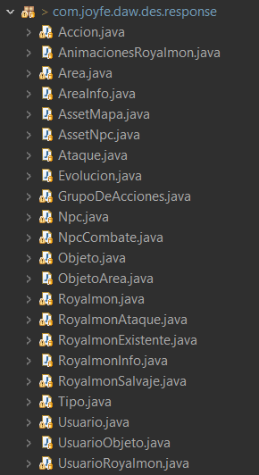
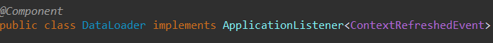
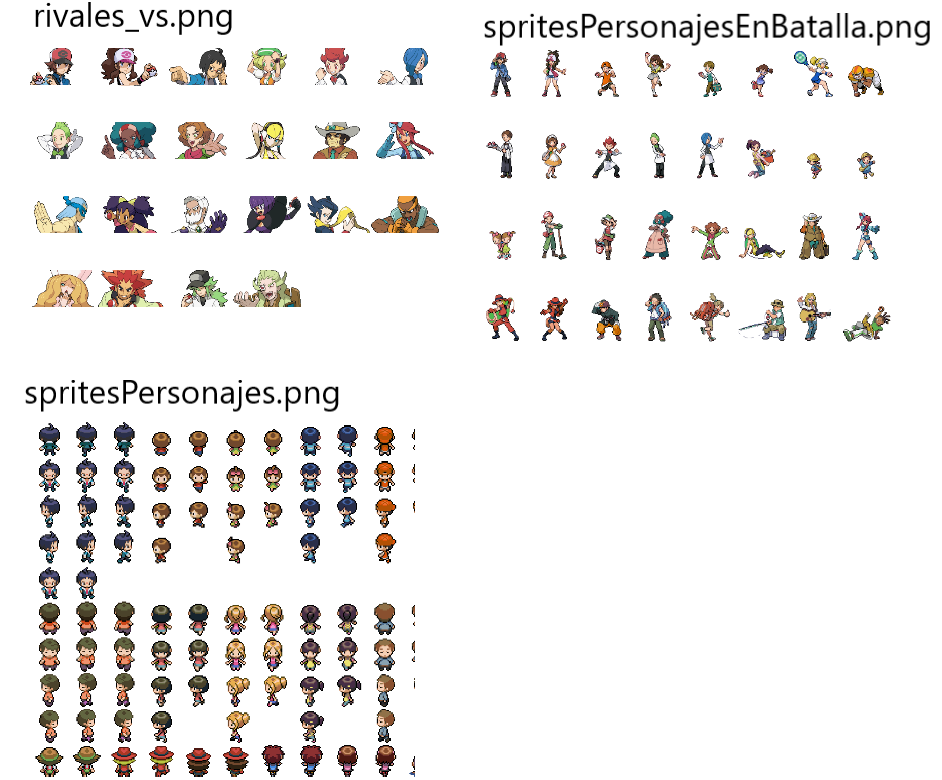
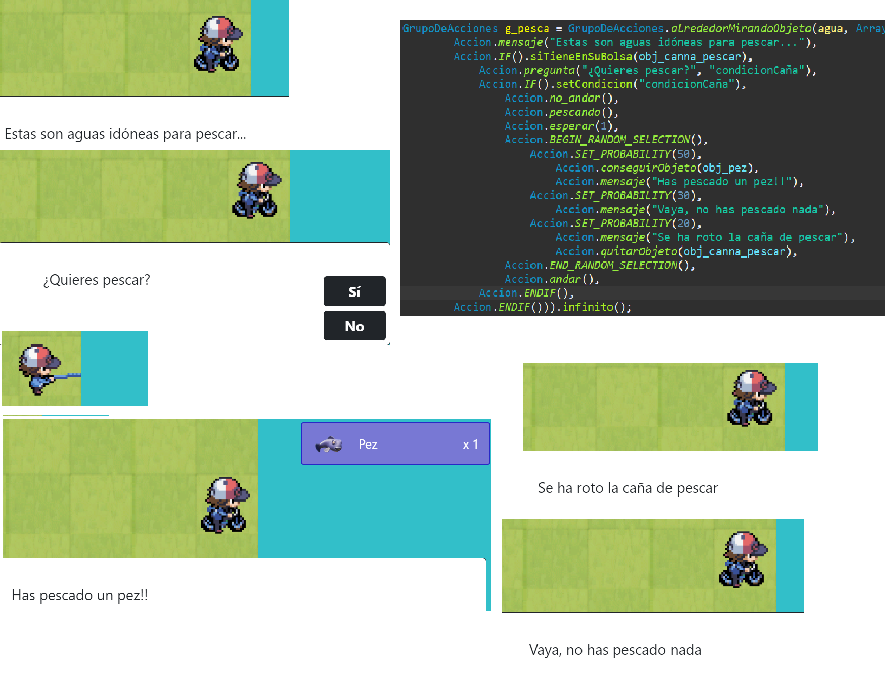

# Royalmon

Este juego combina dos juegos ya existentes, Clash Royale y Pokémon.
 
A continuación les muestro una comparativa entre los 3 juegos:
| Clash Royale | Pokémon | Royalmon |
|--------------|--------------|--------------|
|  |  |  |
| Es un videojuego que enfrenta a los jugadores en juegos con dos o cuatro jugadores (1v1 o 2v2) en los que el objetivo es destruir las torres enemigas (si es destruida la Torre del Rey se acaba la partida). | El juego de Pokémon es un mundo de fantasía en el que los entrenadores, generalmente jóvenes, emprenden una aventura para capturar y entrenar Pokémon, criaturas con habilidades únicas y poderes elementales. Los entrenadores aspiran a convertirse en Maestros Pokémon al derrotar a otros entrenadores, ganar medallas de gimnasio y enfrentarse al Alto Mando de la Liga Pokémon. El objetivo final es completar la Pokédex, una enciclopedia de Pokémon, capturando a todas las especies disponibles | Tiene la misma jugabilidad del juego de pokémon, pero las criaturas de mi juego, son las tropas de Clash Royale |

## ¿Cómo lo he programado?

El juego está programado en Angular, y está pensado para jugarlo en ordenador.
 
Tiene dos formas de funcionar, dependiendo del valor de una variable global del programa llamado useApi:

- **Usando spring boot como backend:** Todas las acciones, configuraciones del juego, datos de los royalmons y todo, depende de este, que mediante el uso de mapeo objeto-relacional (ORM) proporcionado por JPA (Java Persistence API) a través de la anotación @Entity en las clases Java, se crearán todas las tablas en la BBDD para del juego. 

  - Las clases que tiene el juego son todas estas: 
      
  - Cuando terminan de crearse las clases uso esta clase para que cargue toda la información del juego: 
     

    Los objetos que puede tener el jugador, que se conseguirán en el juego en las tiendas (con dinero ficticio del juego) o de otras formas: 
    

    Los npcs que son los personajes que te encontrarás a lo largo de la historia y se configuran así: 
     
    Cada parámetro funciona de esta forma, por ejemplo el personaje Miguel, aparecerá en el área a la que asignemos al final, en la casilla 12 5, y por defecto estará mirando a la izquierda, luego le configuro su asset correspondiente con su imagen de spritesPersonajes.png  
    Entonces desde angular, sabrá que asset ponerle a partir de las fotos con esos datos: 
     

    Los ataques que pueden tener los royalmons: 
     

    Los royalmons salvajes: 
      
    Donde indico que royalmons van a aparecer salvajes en una cierta parte del mapa, de que nivel a que nivel pueden salir, y que posibilidad tiene cada uno de aparecer, en este caso, sólo hay dos, y cada uno tiene un 50% de posibilidades de aparecer.  
    Respecto las acciones y/o eventos que pasan durante el juego, se configuran de esta forma tan sencilla:
    Los eventos, son una lista de la clase GrupoDeAcciones, que se encuentran en cada área, y en ellos contiene, el tipo de activación de las acciones, ya que unas se ejecutan cuando el jugador está en unas coordenadas específicas, otras cuando interactúo con objetos o npcs en el mapa, otras cuando un npc mira al jugador, pudiendo estar a unas 5 casillas de distancia suya, y cuando esto ocurre, se ejecutarán todas las acciones en orden que tenga este grupo.
    
    
    
     

    La información de los royalmons es la única que no se carga directamente con clases en java, si no que programé un formulario desde angular, que genera un JSON con la información de los royalmons y ese JSON, lo lee el backend para insertar esta información: 
    
    
    
    
     
    También mencionar que fuí programando el juego sólo con la arquera y el baby dragon, pero la aplicación esta diseñada para meter todos los royalmons que vaya queriendo, de echo, todas las configuraciones mostradas anteriormente, son para una prueba del juego que podréis descargar y probar.

- **Usando ficheros:** Cuando ya está la aplicación con todos los datos, puedo configurar para que use ficheros, que previamente fueron guardados con toda la información del juego que vinieron en JSON del spring boot encriptada. La prueba que hay para jugar a este juego viene con esta configuracion activada, por lo que no hace falta backend, ya que para guardar el progreso de la partida y para leer los datos del juego usa ficheros. 
  

La juego es bastante complejo y con todo esto, aún así no he podido explicar todo, así que dejaré algunos archivos sueltos para que podáis ver, tanto del java como de angular como imágenes que utiliza el juego.

Descarga la prueba del juego aquí:
<a target="_blank" href="juego" >ENLACE</a>

Para ver algunos archivos de la aplicación:

- Aunque no subo el código completo, puedes ver aquí algunos ficheros que usa la aplicación:
- <a target="_blank" href="archivos_basicos_app" >VER ARCHIVOS</a>
